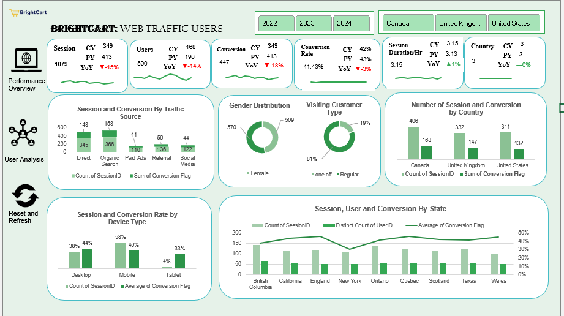

# BrightCart Traffic & Conversion Optimization

This repository contains the files for a data analytics project focused on understanding website traffic patterns for an online retail business. The analysis explores how user engagement varies by time of day, day of the week, and marketing channels such as organic search, paid ads, social media, and email campaigns.

## 📊 Dashboard Preview

*Excel dashboard showing hourly traffic trends and channel performance.*

## 📌 Project Overview
The goal of this project is to uncover actionable insights that help improve campaign timing, strengthen conversion rates, and support data-driven marketing decisions. Excel was used for data cleaning, exploration, visualization, and dashboard creation.

## 🎯 Objectives
- Identify peak and low-traffic periods  
- Analyze channel performance and conversion effectiveness  
- Support smarter marketing timing and budget allocation  
- Provide actionable recommendations for improving ROI  

## 🛠️ Tools Used
- Microsoft Excel  
- Pivot tables  
- Charts and dashboards  
- Basic segmentation and trend analysis  

## 📁 Deliverables
- Interactive Excel dashboards  
- Traffic and conversion trend visualizations  
- Channel performance summaries  
- Strategic recommendations for marketing optimization  

## 🌐 GitHub Pages
View the full project page here:  
**https://mercypel.github.io/BrightCart/**
